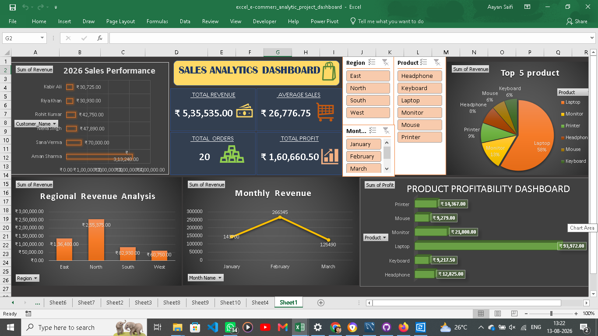

# E-Commerce Sales Analytics Dashboard

## 📌 Project Overview

This project is an interactive **E-Commerce Sales Analytics Dashboard** developed using Microsoft Excel.

The project focuses on analyzing e-commerce sales data and transforming raw data into meaningful business insights through data analysis, Pivot Tables, charts, and interactive slicers.

The dashboard provides a clear overview of sales performance, revenue trends, profitability, and product performance to support data-driven decision-making.

## 🎯 Project Objectives

- Analyze overall e-commerce sales performance
- Track revenue, orders, and profit
- Identify high-performing regions and products
- Analyze monthly revenue trends
- Compare product profitability
- Create an interactive and user-friendly dashboard
- Present business insights through effective data visualization

## 📊 Dashboard Features

### 🔹 Key Performance Metrics

The dashboard provides important business KPIs, including:

- **Total Revenue**
- **Average Sales**
- **Total Orders**
- **Total Profit**

### 🔹 Regional Revenue Analysis

A visual comparison of revenue performance across:

- East
- North
- South
- West

This helps identify regions contributing the most to overall revenue.

### 🔹 Monthly Revenue Trends

A line chart is used to analyze monthly revenue trends and identify changes in sales performance over time.

### 🔹 Product Profitability

The dashboard provides a visual analysis of profitability across different product categories to identify stronger-performing categories.

### 🔹 Top 5 Products

The dashboard highlights the **Top 5 products by revenue**, helping identify the products contributing most to sales.

### 🔹 Interactive Filters

Interactive slicers allow users to dynamically filter the dashboard by:

- Region
- Product
- Month

This makes it easier to explore the data from different perspectives.

## 🖼️ Dashboard Preview

## 🛠️ Tools & Technologies

- **Microsoft Excel**
- Pivot Tables
- Excel Charts
- Slicers
- Data Analysis
- Dashboard Design

## 📁 Project Files

| File | Description |
|---|---|
| `excel_e-commers_analytic_project_dashboard.xlsx` | Complete Excel workbook containing the sales analysis and interactive dashboard |
| `E-commerce_dashboard_Screenshot.png` | Preview screenshot of the completed dashboard |
| `README.md` | Project documentation |

## 🚀 How to Use

1. Download the `excel_e-commers_analytic_project_dashboard.xlsx` file.
2. Open the workbook using Microsoft Excel.
3. Navigate to the dashboard sheet.
4. Use the available slicers to filter the analysis by Region, Product, or Month.
5. Explore the KPIs, charts, revenue trends, and product performance.

## 💡 Key Insights

The dashboard helps users understand:

- Overall revenue and profit performance
- Regional sales contribution
- Monthly revenue movement
- Product-level performance
- Top-performing products
- The impact of different filters on sales analysis

## 📚 Key Learnings

Through this project, I gained practical experience in:

- Data analysis using Microsoft Excel
- Building Pivot Tables
- Creating interactive dashboards
- Designing meaningful data visualizations
- Using slicers for interactive filtering
- Converting raw sales data into actionable business insights
- Presenting analytical findings in a business-friendly format

## ✅ Project Status

**Completed**

## 👨‍💻 Author

**Aayan Saifi**

Data Analytics Enthusiast
